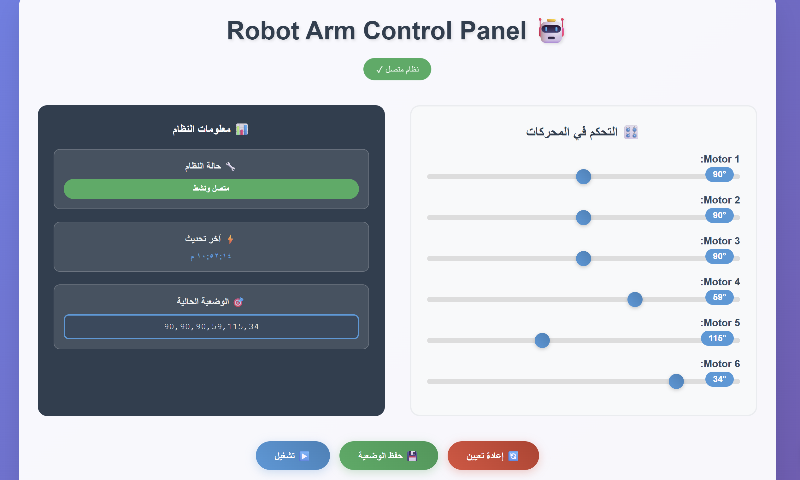
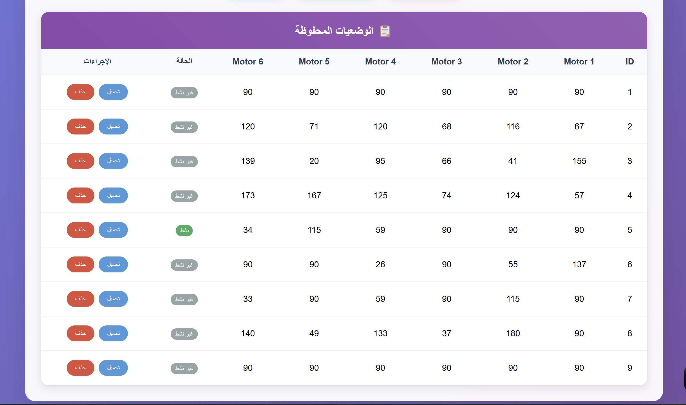
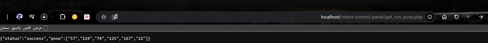
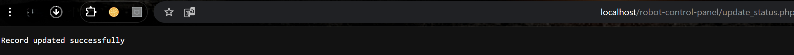

#  Robot Arm Control Panel

## Advanced Web-Based 6-DOF Robot Arm Controller

A sophisticated web interface for controlling a 6-axis robotic arm with pose saving and management capabilities.

## web preview



#### -`get_run_pose.php` result:


#### -`update_status.php` result:



## ✨ Features

- 🎛️ **Real-time Control**: Independent control of 6 servo motors (0-180 degrees)
- 💾 **Pose Management**: Save, load, and manage different arm positions
- 📋 **Database Integration**: Persistent storage of poses with MySQL
- 🔄 **Live Updates**: Real-time synchronization with database
- 📱 **Responsive Design**: Works seamlessly on all devices
- 🌐 **Bilingual Interface**: Arabic UI with English documentation
- ⚡ **High Performance**: Instant response to commands
- 🎯 **Active Pose Tracking**: Visual indication of current active pose

## 🛠️ Requirements

### Server Environment
- **XAMPP**, **WAMP**, or **LAMP** stack
- **PHP 7.4+**
- **MySQL 5.7+**
- **Apache Web Server**

## 📦 Installation

### 1. Server Setup
```bash
# Download and install XAMPP
# Start Apache and MySQL from XAMPP Control Panel
```

### 2. Database Configuration
```sql
-- Create database
CREATE DATABASE `robot-control-panel`;

-- Use database
USE `robot-control-panel`;

-- Create poses table
CREATE TABLE `poses` (
  `id` int AUTO_INCREMENT,
  `motor1` smallint UNSIGNED NOT NULL,  -- 0-65,535 range
  `motor2` smallint UNSIGNED NOT NULL,
  `motor3` smallint UNSIGNED NOT NULL,
  `motor4` smallint UNSIGNED NOT NULL,
  `motor5` smallint UNSIGNED NOT NULL,
  `motor6` smallint UNSIGNED NOT NULL,
  `status` tinyint DEFAULT 0,
  PRIMARY KEY (`id`)
);

-- Insert sample data
INSERT INTO `poses` (`motor1`, `motor2`, `motor3`, `motor4`, `motor5`, `motor6`, `status`) VALUES
(90, 90, 90, 90, 90, 90, 1),
(45, 135, 60, 120, 75, 105, 0),
(0, 180, 90, 90, 45, 135, 0);
```

### 4. Database Configuration
```php
// Ensure correct database settings in all PHP files:
$servername = "localhost";
$username = "root";          // Database username
$password = "";              // Database password (empty for XAMPP)
$dbname = "robot-control-panel";
```

## 🚀 Usage

### Starting the System
1. Launch XAMPP and start Apache & MySQL services
2. Open browser and navigate to: `http://localhost/robot-arm-controller/`

### Control Interface

#### Motor Control
- Use sliders to adjust motor angles (0-180°)
- Real-time value display and position feedback
- Automatic pose synchronization

#### Pose Management
- **Save**: Store current motor positions to database
- **Load**: Recall saved poses and apply to motors
- **Delete**: Remove poses from database
- **Run**: Execute current pose and mark as active

### Control Buttons
- 🔄 **Reset**: Return all motors to 90° (neutral position)
- 💾 **Save Pose**: Store current configuration
- ▶️ **Run**: Execute and activate current pose


## 🔧 Troubleshooting

### Common Issues and Solutions

#### Database Connection Error
```
Error: "Database robot-control-panel does not exist"
Solution: Create database as shown in installation section
```

#### MySQL Connection Failed
```
Error: "Cannot connect to MySQL server"
Solution: Ensure MySQL is running in XAMPP Control Panel
```

---

